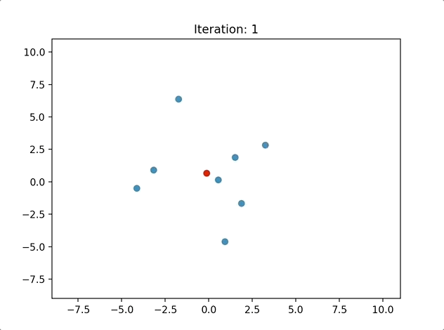

## Sun and Moon Simulation
A simulation of a popular Improv game that has some interesting dynamic graph properties

Note: The red dot here is the center of the point distribution

## Motivation
A few years ago I took an introductory Improv class and one of the excercises we did was called "Sun and Moon". Here is an explanation of the rules via [portlandcomedy.com](https://www.portlandcomedy.com/applied-improv-blog/2015/8/5/lujzvyypznja3h22ccata1aarxxsmq):

>Sun and Moon is a simple and profound activity. Participants stand in a circle, and are asked to pick a “sun” and a “moon” from among the other people. They are not to let on who they’ve picked; it’s a secret. When the game starts, they are to move quickly to “become equidistant” from their sun and moon, as fast as they can, and if their targets move on them, they have to keep moving. Chaos ensues.

I think "chaos ensues" is a very apt way of describing the game because it is essentially a system that has very sensitive initial conditions and has weird convergence behavior. At any rate, I thought it was interesting enough to simulate so I decided to create a model.

## The Model

We randomly generate a set of x,y coordinates (players) and assign each player two random "partners" from the set. At every step of the simulation the player makes a move to get equidistant with both partners (this is calculated using some vector algebra). The simulation converges when the this happens when the average difference of every point with its previous coordinate is less than a specified threshold.

## Further Work

Some of these configurations do not converge, and there is a lot of various of the convergence time of those that do. It would be interesting to see if we could relate the convergence time to some sort of scalar descriptor of these systems (effectively weighted,directed graphs). One candidate is the largest eigenvalue of the Laplacian. I hope to get around to this soon
